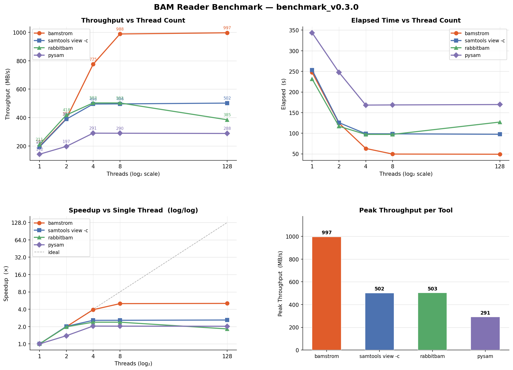

# bamstorm

A high-performance parallel BAM reader for large-scale genomics workloads, written in Rust with Python bindings via PyO3.

## Background and motivation

The BAM format and the toolchain built around it (samtools, htslib, pysam) were designed in an era when storage was spinning disk and servers had a handful of cores. The dominant bottleneck was sequential read bandwidth, so a single-threaded IO loop made sense: one thread saturated the disk, and any extra parallelism was spent on BGZF decompression.

Modern infrastructure has changed that picture. NVMe SSDs expose multiple IO queues and can sustain hundreds of thousands of IOPS with near-zero seek cost. Servers routinely ship with 32, 64, or 128 cores. Cloud instances are sold by the core-hour, so wall-clock time directly maps to cost. Yet the standard BAM IO path has not fundamentally changed — it still issues a single sequential read stream, leaving most of the available hardware idle.

bamstorm is a ground-up redesign of the BAM read path for this hardware generation. Instead of one sequential stream, it uses the BAI linear index to partition the file into independent byte ranges and reads all of them concurrently — saturating multiple IO queues and all available cores simultaneously. The result is a tool that treats a 48 GB BAM file the way modern hardware expects: as a parallel IO problem, not a serial one.

The practical consequence is a direct reduction in analysis cost for industrial-scale bioinformatics pipelines. A workflow that counts or scans hundreds of whole-genome BAM files per day can cut its compute footprint by 2–3× simply by replacing the IO layer, with no changes to downstream logic.

## How it works

Standard tools (samtools, pysam/htslib) read BAM files with a single IO thread and decompress BGZF blocks in parallel. **bamstorm** takes a different approach: it uses the BAI linear index to split the file into independent byte-range intervals, then reads and decompresses all intervals simultaneously with rayon.

```
htslib:  single fd → sequential read → parallel BGZF decompress
bamstorm: BAI intervals → N parallel fds → parallel read + decompress
```

## Related tools

Several tools have tackled BAM parallelism before bamstorm, each with a different approach.

### QuickBAM

[QuickBAM](https://gitlab.com/yiq/quickbam) (C++, OpenMP / Intel TBB) uses the BAI index's fixed 16 KB bin structure as the unit of parallelism. Each bin becomes an independent work item dispatched to a thread pool. For files without an index it falls back to a heuristic scanner that locates safe parallel entry points by pattern-matching BGZF block headers.

```
BAI fixed bins → scatter work items → thread pool (OpenMP/TBB)
                                         ├── read bin bytes
                                         ├── BGZF decompress
                                         └── compute (pileup, count, …)
                                     → aggregate results
```

The key constraint is that work granularity is tied to the 16 KB bin grid; very large or skewed bins can create load-imbalance. QuickBAM reports 1.5+ GiB/s peak throughput on pileup workloads (38× faster than single-threaded baselines on the same hardware).

### RabbitBAM

[RabbitBAM](https://github.com/RabbitBio/RabbitBAM) (C/C++) targets the parsing bottleneck rather than the IO bottleneck. A dedicated pre-parsing stage scans the byte stream to locate record boundaries without fully decoding each record. Those boundaries are queued into lock-free queues backed by memory pools, and a pool of parser threads consumes them in parallel.

```
single fd → sequential read → BGZF decompress
                                   → pre-parser: locate record boundaries
                                   → lock-free queue
                                   → parser thread pool: decode records in parallel
```

The design eliminates lock contention and copy overhead during parsing, which is the dominant cost for short-read BAMs where record count is high. RabbitBAM achieves 2.1–3.3× speedup over samtools/htslib on NGS datasets.

### How bamstorm differs

Both QuickBAM and RabbitBAM retain a single sequential IO stream and parallelize the work *after* bytes are read. bamstorm moves the parallelism to the IO layer itself: by splitting the file into independent byte-range intervals (derived from the BAI linear index), it opens N file descriptors and issues N concurrent read+decompress streams simultaneously. On NVMe storage this saturates multiple IO queues, something a single-stream design cannot do regardless of how many decompression threads it spawns.

## Installation

**Python (recommended)**

```bash
pip install bamstorm
```

Wheels are built against the stable ABI (`abi3`) and work on Python 3.8+.

**From source (requires Rust)**

```bash
git clone https://github.com/Wan-Yifei/bamstorm
cd bamstorm
pip install maturin
maturin develop --release --features python
```

## Python usage

```python
import bamstorm

# Mapped reads only — matches pysam.AlignmentFile.count()
mapped = bamstorm.count("sample.bam", "sample.bam.bai")

# All reads including unmapped — matches pysam.AlignmentFile.count(until_eof=True)
total = bamstorm.count("sample.bam", "sample.bam.bai", until_eof=True)

print(f"mapped={mapped}  total={total}  unmapped={total - mapped}")

# Same API on AlignmentFile
with bamstorm.AlignmentFile("sample.bam", "sample.bam.bai") as af:
    mapped = af.count()
    total  = af.count(until_eof=True)

# Iterate over records
with bamstorm.AlignmentFile("sample.bam", "sample.bam.bai") as af:
    for read in af:
        if read.is_unmapped:
            continue
        print(read.query_name, read.reference_start, read.cigarstring)
```

### `BamRecord` attributes

| Attribute | Type | Description |
|-----------|------|-------------|
| `query_name` | `str \| None` | Read name |
| `flag` | `int` | SAM flag |
| `reference_id` | `int \| None` | Reference sequence index |
| `reference_start` | `int \| None` | 0-based alignment start |
| `mapping_quality` | `int \| None` | MAPQ |
| `cigarstring` | `str` | CIGAR string (e.g. `"101M"`) |
| `query_sequence` | `str` | Nucleotide sequence |
| `template_length` | `int` | TLEN |
| `is_paired` | `bool` | Flag 0x1 |
| `is_proper_pair` | `bool` | Flag 0x2 |
| `is_unmapped` | `bool` | Flag 0x4 |
| `is_mate_unmapped` | `bool` | Flag 0x8 |
| `is_reverse` | `bool` | Flag 0x10 |
| `is_secondary` | `bool` | Flag 0x100 |
| `is_qcfail` | `bool` | Flag 0x200 |
| `is_duplicate` | `bool` | Flag 0x400 |
| `is_supplementary` | `bool` | Flag 0x800 |

## Rust usage

Add to `Cargo.toml`:

```toml
[dependencies]
bamstorm = { git = "https://github.com/Wan-Yifei/bamstorm" }
```

```rust
use bamstorm::{bai_parser::{get_linear_indexes, get_linear_intervals}, count_all_records};

let indexes = get_linear_indexes("sample.bam.bai")?;
let intervals = get_linear_intervals(&indexes)?;
let total = count_all_records("sample.bam", &intervals)?;
```

## Working alongside pysam

bamstorm and pysam are complementary. bamstorm accelerates bulk IO; pysam provides flexible record manipulation, random-access region queries, and full tag support.

### Drop-in replacement for counting

```python
import pysam
import bamstorm

# Mapped reads
with pysam.AlignmentFile("sample.bam", "rb") as af:
    n = af.count()                                           # pysam
n = bamstorm.count("sample.bam", "sample.bam.bai")          # bamstorm — parallel equivalent

# All reads (including unmapped)
with pysam.AlignmentFile("sample.bam", "rb") as af:
    n = af.count(until_eof=True)                             # pysam
n = bamstorm.count("sample.bam", "sample.bam.bai",
                   until_eof=True)                           # bamstorm — parallel equivalent
```

### Pre-filter with bamstorm, then process with pysam

Use bamstorm to quickly collect read names or flags that pass a criterion, then re-fetch only those reads with pysam for detailed processing.

```python
import bamstorm
import pysam

# Step 1: fast parallel scan — collect names of mapped, non-duplicate reads
keep = set()
with bamstorm.AlignmentFile("sample.bam", "sample.bam.bai") as af:
    for read in af:
        if not read.is_unmapped and not read.is_duplicate:
            keep.add(read.query_name)

print(f"keeping {len(keep)} reads")

# Step 2: pysam for full tag access on the filtered set
with pysam.AlignmentFile("sample.bam", "rb") as af:
    for read in af.fetch(until_eof=True):
        if read.query_name in keep:
            cb = read.get_tag("CB") if read.has_tag("CB") else None
            # ... complex processing
```

### When to use each

| Task | Recommended |
|------|-------------|
| Count mapped reads | `bamstorm.count()` |
| Count all reads (incl. unmapped) | `bamstorm.count(until_eof=True)` |
| Bulk flag filtering | `bamstorm.AlignmentFile` |
| Simple field access (name, flag, pos, CIGAR, seq) | `bamstorm.AlignmentFile` |
| Random-access fetch by genomic region | pysam |
| Full tag access (`get_tag`, `get_tags`) | pysam |
| Writing / modifying BAM files | bamstorm Rust API or pysam |
| Complex per-read logic using pysam's full API | pysam |

### Note on object compatibility

`bamstorm.BamRecord` and `pysam.AlignedSegment` are separate types — you cannot pass a `BamRecord` directly to pysam APIs. For operations that require pysam's full `AlignedSegment` interface, use pysam directly. A `.to_pysam()` conversion method is planned for a future release.

## Benchmark

Tested on a 47.8 GB coordinate-sorted BAM (899,477,438 records). Best-of-3 runs, OS page cache dropped between runs.

### v0.3.0 results



**Throughput (MB/s) — higher is better**

| Threads | bamstorm | samtools | rabbitbam | pysam |
|--------:|---------:|---------:|----------:|------:|
| 1       | 197      | 193      | 211       | 142   |
| 2       | 392      | 389      | 418       | 197   |
| 4       | 775      | 496      | 503       | 291   |
| 8       | **988**  | 496      | 503       | 290   |
| 128     | **997**  | 502      | 385       | 288   |

Key observations:

- bamstorm peaks at **~997 MB/s**, roughly **2× faster** than samtools and rabbitbam (~502 MB/s) and **3.4× faster** than pysam (~291 MB/s).
- bamstorm scales linearly up to 8 threads (~5× over single-thread), then plateaus — the workload becomes IO-bound at that point.
- samtools and rabbitbam plateau at 4 threads (~500 MB/s); neither benefits further from more cores.
- rabbitbam degrades at 128 threads (384 MB/s) due to over-subscription overhead.
- pysam is CPU-limited at all thread counts, topping out at ~291 MB/s.

### Running the benchmark

```bash
./bench/run_bench.sh /data/sample.bam /data/sample.bam.bai --csv results.csv
```

This builds the benchmark Docker image and runs `bench.py` inside it against samtools, rabbitbam, and pysam. The `--csv` flag writes raw results to the host for plotting with `bench/plot_report.py`.

## Requirements

- BAM file must be coordinate-sorted and indexed (`.bai`)
- Python ≥ 3.8 (for Python bindings)
- Rust ≥ 1.85 (for building from source)
