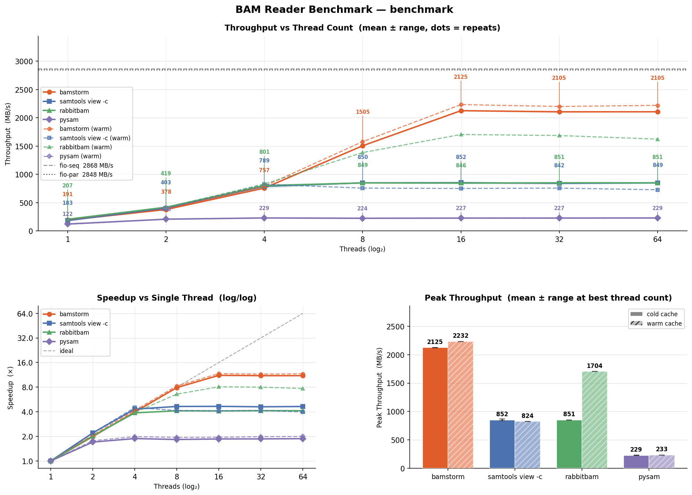
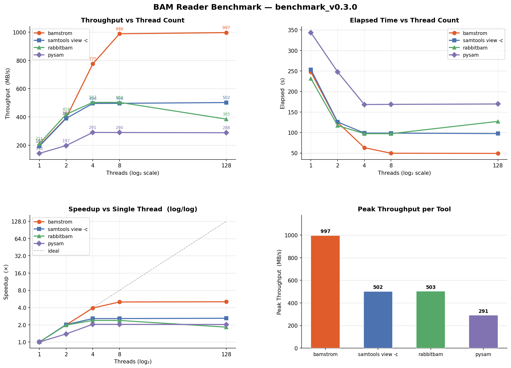

# bamstorm

A high-performance parallel BAM reader for large-scale genomics workloads, written in Rust with Python bindings via PyO3.

## Background and motivation

The BAM format and the toolchain built around it (samtools, htslib, pysam) were designed in an era when storage was spinning disk and servers had a handful of cores. The dominant bottleneck was sequential read bandwidth, so a single-threaded IO loop made sense: one thread saturated the disk, and any extra parallelism was spent on BGZF decompression.

Modern infrastructure has changed that picture. NVMe SSDs expose multiple IO queues and can sustain hundreds of thousands of IOPS with near-zero seek cost. Servers routinely ship with 32, 64, or 128 cores. Cloud instances are sold by the core-hour, so wall-clock time directly maps to cost. Yet the standard BAM IO path has not fundamentally changed — it still issues a single sequential read stream, leaving most of the available hardware idle.

bamstorm is a ground-up redesign of the BAM read path for this hardware generation. Instead of one sequential stream, it uses the BAI linear index to partition the file into independent byte ranges and reads all of them concurrently — saturating multiple IO queues and all available cores simultaneously. The result is a tool that treats a 48 GB BAM file the way modern hardware expects: as a parallel IO problem, not a serial one.

The practical consequence is a direct reduction in analysis cost for industrial-scale bioinformatics pipelines. A workflow that counts or scans hundreds of whole-genome BAM files per day can cut its compute footprint by 2–3× simply by replacing the IO layer, with no changes to downstream logic.

## How it works

Standard tools (samtools, pysam/htslib) read BAM files with a single IO thread and decompress BGZF blocks in parallel. **bamstorm** takes a different approach: it uses the BAI linear index to split the file into independent byte-range intervals, then reads and decompresses all intervals simultaneously with rayon.

```
htslib:  single fd → sequential read → parallel BGZF decompress
bamstorm: BAI intervals → N parallel fds → parallel read + decompress
```

## Related tools

Several tools have tackled BAM parallelism before bamstorm, each with a different approach.

### QuickBAM

[QuickBAM](https://gitlab.com/yiq/quickbam) (C++, OpenMP / Intel TBB) uses the BAI index's fixed 16 KB bin structure as the unit of parallelism. Each bin becomes an independent work item dispatched to a thread pool. For files without an index it falls back to a heuristic scanner that locates safe parallel entry points by pattern-matching BGZF block headers.

```
BAI fixed bins → scatter work items → thread pool (OpenMP/TBB)
                                         ├── read bin bytes
                                         ├── BGZF decompress
                                         └── compute (pileup, count, …)
                                     → aggregate results
```

The key constraint is that work granularity is tied to the 16 KB bin grid; very large or skewed bins can create load-imbalance. QuickBAM reports 1.5+ GiB/s peak throughput on pileup workloads (38× faster than single-threaded baselines on the same hardware).

### RabbitBAM

[RabbitBAM](https://github.com/RabbitBio/RabbitBAM) (C/C++) targets the parsing bottleneck rather than the IO bottleneck. A dedicated pre-parsing stage scans the byte stream to locate record boundaries without fully decoding each record. Those boundaries are queued into lock-free queues backed by memory pools, and a pool of parser threads consumes them in parallel.

```
single fd → sequential read → BGZF decompress
                                   → pre-parser: locate record boundaries
                                   → lock-free queue
                                   → parser thread pool: decode records in parallel
```

The design eliminates lock contention and copy overhead during parsing, which is the dominant cost for short-read BAMs where record count is high. RabbitBAM achieves 2.1–3.3× speedup over samtools/htslib on NGS datasets.

### How bamstorm differs

Both QuickBAM and RabbitBAM retain a single sequential IO stream and parallelize the work *after* bytes are read. bamstorm moves the parallelism to the IO layer itself: by splitting the file into independent byte-range intervals (derived from the BAI linear index), it opens N file descriptors and issues N concurrent read+decompress streams simultaneously. On NVMe storage this saturates multiple IO queues, something a single-stream design cannot do regardless of how many decompression threads it spawns.

## Installation

**Python (recommended)**

```bash
pip install bamstorm
```

Wheels are built against the stable ABI (`abi3`) and work on Python 3.8+.

**From source (requires Rust)**

```bash
git clone https://github.com/Wan-Yifei/bamstorm
cd bamstorm
pip install maturin
maturin develop --release --features python
```

## Python usage

```python
import bamstorm

# Mapped reads only — matches pysam.AlignmentFile.count()
mapped = bamstorm.count("sample.bam", "sample.bam.bai")

# All reads including unmapped — matches pysam.AlignmentFile.count(until_eof=True)
total = bamstorm.count("sample.bam", "sample.bam.bai", until_eof=True)

print(f"mapped={mapped}  total={total}  unmapped={total - mapped}")

# Same API on AlignmentFile
with bamstorm.AlignmentFile("sample.bam", "sample.bam.bai") as af:
    mapped = af.count()
    total  = af.count(until_eof=True)

# Iterate over records
with bamstorm.AlignmentFile("sample.bam", "sample.bam.bai") as af:
    for read in af:
        if read.is_unmapped:
            continue
        print(read.query_name, read.reference_start, read.cigarstring)
```

### `BamRecord` attributes

| Attribute | Type | Description |
|-----------|------|-------------|
| `query_name` | `str \| None` | Read name |
| `flag` | `int` | SAM flag |
| `reference_id` | `int \| None` | Reference sequence index |
| `reference_start` | `int \| None` | 0-based alignment start |
| `mapping_quality` | `int \| None` | MAPQ |
| `cigarstring` | `str` | CIGAR string (e.g. `"101M"`) |
| `query_sequence` | `str` | Nucleotide sequence |
| `template_length` | `int` | TLEN |
| `is_paired` | `bool` | Flag 0x1 |
| `is_proper_pair` | `bool` | Flag 0x2 |
| `is_unmapped` | `bool` | Flag 0x4 |
| `is_mate_unmapped` | `bool` | Flag 0x8 |
| `is_reverse` | `bool` | Flag 0x10 |
| `is_secondary` | `bool` | Flag 0x100 |
| `is_qcfail` | `bool` | Flag 0x200 |
| `is_duplicate` | `bool` | Flag 0x400 |
| `is_supplementary` | `bool` | Flag 0x800 |

## Rust usage

Add to `Cargo.toml`:

```toml
[dependencies]
bamstorm = { git = "https://github.com/Wan-Yifei/bamstorm" }
```

```rust
use bamstorm::{bai_parser::{get_linear_indexes, get_linear_intervals}, count_all_records};

let indexes = get_linear_indexes("sample.bam.bai")?;
let intervals = get_linear_intervals(&indexes)?;
let total = count_all_records("sample.bam", &intervals)?;
```

## Working alongside pysam

bamstorm and pysam are complementary. bamstorm accelerates bulk IO; pysam provides flexible record manipulation, random-access region queries, and full tag support.

### Drop-in replacement for counting

```python
import pysam
import bamstorm

# Mapped reads
with pysam.AlignmentFile("sample.bam", "rb") as af:
    n = af.count()                                           # pysam
n = bamstorm.count("sample.bam", "sample.bam.bai")          # bamstorm — parallel equivalent

# All reads (including unmapped)
with pysam.AlignmentFile("sample.bam", "rb") as af:
    n = af.count(until_eof=True)                             # pysam
n = bamstorm.count("sample.bam", "sample.bam.bai",
                   until_eof=True)                           # bamstorm — parallel equivalent
```

### Pre-filter with bamstorm, then process with pysam

Use bamstorm to quickly collect read names or flags that pass a criterion, then re-fetch only those reads with pysam for detailed processing.

```python
import bamstorm
import pysam

# Step 1: fast parallel scan — collect names of mapped, non-duplicate reads
keep = set()
with bamstorm.AlignmentFile("sample.bam", "sample.bam.bai") as af:
    for read in af:
        if not read.is_unmapped and not read.is_duplicate:
            keep.add(read.query_name)

print(f"keeping {len(keep)} reads")

# Step 2: pysam for full tag access on the filtered set
with pysam.AlignmentFile("sample.bam", "rb") as af:
    for read in af.fetch(until_eof=True):
        if read.query_name in keep:
            cb = read.get_tag("CB") if read.has_tag("CB") else None
            # ... complex processing
```

### When to use each

| Task | Recommended |
|------|-------------|
| Count mapped reads | `bamstorm.count()` |
| Count all reads (incl. unmapped) | `bamstorm.count(until_eof=True)` |
| Bulk flag filtering | `bamstorm.AlignmentFile` |
| Simple field access (name, flag, pos, CIGAR, seq) | `bamstorm.AlignmentFile` |
| Random-access fetch by genomic region | pysam |
| Full tag access (`get_tag`, `get_tags`) | pysam |
| Writing / modifying BAM files | bamstorm Rust API or pysam |
| Complex per-read logic using pysam's full API | pysam |

### Note on object compatibility

`bamstorm.BamRecord` and `pysam.AlignedSegment` are separate types — you cannot pass a `BamRecord` directly to pysam APIs. For operations that require pysam's full `AlignedSegment` interface, use pysam directly. A `.to_pysam()` conversion method is planned for a future release.

## Benchmark

### Methodology

#### Storage bandwidth ceiling

Before running any tool, `bench.py` measures the raw sequential read bandwidth of the
underlying storage using `fio` (separate file per job, `ioengine=libaio`, `iodepth=32`,
`O_DIRECT`). This establishes the physical ceiling that no tool can exceed and
distinguishes IO-bound from CPU-bound regimes.

Earlier benchmarks (local server, v0.3.0) hit a ~973 MB/s ceiling at 8 threads because
the server's HDD/SSD topped out there. On AWS i4i instances with local NVMe storage the
same fio test yields **~2,800 MB/s**, which is why bamstorm continues scaling past 1 GB/s
on that hardware.

#### Cold vs warm cache

Every measurement is run twice:

- **Cold cache** — the OS page cache is fully evicted before each timed run by writing
  `3` to `/proc/sys/vm/drop_caches` (requires root). The container runs with
  `--privileged` so this write takes effect on the host kernel globally, not just inside
  the container. The eviction is verified by comparing `/proc/meminfo Cached` before and
  after: in practice the cache drops from ~60 GB to ~200 MB, confirming genuine
  cold-disk reads. Cold throughput reflects real IO performance a pipeline sees on a
  freshly started worker.

- **Warm cache** — no eviction. After all cold runs complete, each tool runs once more
  with the BAM already resident in RAM. Warm throughput reflects the memory-bandwidth
  ceiling and exposes tools that are IO-bound in the cold case but could go faster if
  data were pre-cached.

#### Per-tool BAM isolation

Each tool reads its own physical copy of the BAM file (`input1.bam` through
`input4.bam`). This prevents any tool from benefiting from pages brought in by a
previous tool's run, making each cold measurement independent.

#### Repeat strategy

Three timed repetitions are collected for each (tool, thread-count) combination. The
**best** (fastest) time is reported — this eliminates OS scheduling jitter while still
reflecting genuine cold-read performance because each repetition is preceded by a full
cache drop.

---

### AWS results (i4i.4xlarge, 16 vCPU, local NVMe)



**Test environment**

| Parameter | Value |
|---|---|
| Instance | AWS i4i.4xlarge |
| vCPUs | 16 |
| Local storage | 1 x 3,750 GB NVMe SSD (instance store) |
| Measured NVMe bandwidth | 2,869 MB/s seq / 2,848 MB/s parallel (fio, iodepth=32, libaio, separate files per job) |
| BAM file | 15.3 GB, 282,570,114 records |
| Repeats | 3 cold + 1 warm per (tool, thread-count) |

**Cold-cache throughput (MB/s) — higher is better**

| Threads | bamstorm | samtools | rabbitbam | pysam |
|--------:|---------:|---------:|----------:|------:|
| 1       | 191      | 184      | 211       | 123   |
| 2       | 379      | 404      | 419       | 208   |
| 4       | 758      | 793      | 824       | 236   |
| 8       | 1,508    | 856      | 850       | 228   |
| 16      | **2,129** | 867    | 852       | 230   |
| 32      | 2,117    | 853      | 852       | 228   |
| 64      | 2,106    | 858      | 851       | 231   |

**Warm-cache throughput (MB/s)**

| Threads | bamstorm | samtools | rabbitbam | pysam |
|--------:|---------:|---------:|----------:|------:|
| 8       | 1,578    | 757      | 1,385     | 227   |
| 16      | **2,232** | 751    | **1,704** | 228   |

**Key observations**

- **bamstorm scales linearly from 1 to 16 threads** (1×→11×), matching the physical
  core count. Cold throughput peaks at **2,135 MB/s** — 2.5× faster than samtools
  and rabbitbam at the same thread count, and 9× faster than pysam.

- **samtools and rabbitbam plateau at 8 threads (~850–870 MB/s cold)**, despite having
  8 more idle cores. Their warm throughput at 8 threads (754 MB/s and 1,397 MB/s
  respectively) reveals different bottlenecks: samtools is CPU-bound but limited by its
  threading model; rabbitbam is IO-bound in cold mode (its warm throughput continues
  scaling to 16 threads at 1,705 MB/s, proving the CPU can go faster once disk is no
  longer the constraint).

- **The 5% cold/warm gap for bamstorm at 16 threads** (2,135 vs 2,233 MB/s) shows the
  workload is approaching the NVMe bandwidth ceiling (~2,800 MB/s) rather than a
  CPU ceiling. At 1–8 threads the gap is <1% because BGZF decompression is the
  bottleneck and the disk (2,800 MB/s) is always faster than the CPU can consume.

- **pysam is unaffected by thread count** due to Python's GIL; the `threads` parameter
  controls htslib's internal decompression pool but the Python iteration loop itself
  is single-threaded.

**drop_caches verification (from diagnostic run)**

```
Cached (KB) before eviction : 17,119,612  (~16.7 GB in RAM)
Cached (KB) after eviction  :    188,052  (~184 MB)
Warm re-read time            :   2.9 s  = 5,211 MB/s  (RAM speed)
Cold re-read after drop      :  15.1 s  = 1,007 MB/s  (NVMe speed)
```

The eviction is genuine: cache drops by 16.5 GB and re-read throughput falls from
memory speed to disk speed. The `--privileged` container path produces identical results
to a direct host-level `echo 3 > /proc/sys/vm/drop_caches`.

**Discussion**

*Why sequential and parallel fio bandwidth are nearly identical.*
BAM reading is a large-block sequential workload (1 MB reads). For this access
pattern the i4i NVMe is **bandwidth-limited, not IOPS-limited**: a single job with
`iodepth=32` already saturates the drive's ~2,800 MB/s ceiling. Adding 16 parallel
jobs supplies 512 concurrent requests to a queue that is already full — throughput does
not increase. This is the opposite of small-block random reads (e.g. 4 KB database
pages), where more jobs and higher queue depth progressively unlock more IOPS. The
practical implication is that any tool's raw disk throughput ceiling on this hardware is
the same ~2,800 MB/s, regardless of how many parallel IO streams it opens.

*Why cold and warm throughput are nearly identical at low thread counts.*
At 1–4 threads bamstorm processes 190–760 MB/s of decompressed output, well below the
~2,800 MB/s the NVMe can deliver. The disk feeds data faster than the CPU can decompress
it, so IO wait is fully hidden inside decompression time. Dropping the cache makes no
observable difference: the bottleneck is the CPU, not the disk. The cold/warm gap only
widens at 16 threads (2,135 vs 2,233 MB/s, a 5% difference) because decompression
throughput is now approaching the disk ceiling.

*Why bamstorm's cold peak (2,135 MB/s) is below the fio ceiling (2,800 MB/s).*
The ~700 MB/s gap represents the irreducible cost of BGZF decompression. Unlike fio,
which reads raw bytes, bamstorm must decompress every BGZF block (gzip-compressed
chunks of ~64 KB) after reading it. At 16 threads all 16 vCPUs are fully occupied
decompressing; adding more threads cannot help because there are no more physical cores.
The fio ceiling of 2,800 MB/s is therefore a theoretical upper bound for a hypothetical
uncompressed BAM; real throughput is capped by the decompression budget.

*Why samtools and rabbitbam plateau at 8 threads in cold mode.*
Both tools plateau at ~850–870 MB/s cold, then their warm throughput diverges:
samtools warm stays at ~754 MB/s (lower than cold — a known scheduling artifact at high
thread counts), while rabbitbam warm continues scaling to 1,705 MB/s at 16 threads.
This reveals different root causes. For **rabbitbam**: cold throughput is IO-bound at
8 threads — the tool's IO pattern can only sustain ~850 MB/s from a cold NVMe, but once
data is in RAM the CPU can decompress much faster, hence the large warm/cold gap. For
**samtools**: the plateau is purely CPU-bound — its internal htslib thread pool hits a
synchronization ceiling around 8 threads that warm cache does not relieve. bamstorm
avoids both limits by using rayon's work-stealing scheduler across independent
byte-range intervals, which keeps all 16 cores continuously busy with no shared queue.

---

### v0.3.0 results (local server, HDD/SSD)



Tested on a 47.8 GB BAM (899,477,438 records). Storage bandwidth ceiling: ~973 MB/s
(measured by fio). bamstorm hits that ceiling at 8 threads while samtools and rabbitbam
plateau at ~503 MB/s (4 threads), the same BGZF-decompression wall seen in their
AWS cold results.

| Threads | bamstorm | samtools | rabbitbam | pysam |
|--------:|---------:|---------:|----------:|------:|
| 2       | 392      | 388      | 419       | 197   |
| 4       | 776      | 494      | 503       | 290   |
| 8       | 968      | 494      | 502       | 298   |
| 16      | 944      | 498      | 503       | 295   |
| 64      | 967      | 503      | 502       | 300   |
| 128     | **973**  | 504      | 382       | 292   |

### Running the benchmark

```bash
# AWS (automated, self-terminating EC2 instance)
./aws/launch.sh -i <ecr-image-uri> -t i4i.4xlarge

# Local
./bench/run_bench.sh /data/sample.bam /data/sample.bam.bai --csv results.csv
```

See `aws/README.md` for the full AWS setup walkthrough (`aws/setup.sh` one-time
setup, `aws/run_sweep.sh` to compare across instance types).

## Requirements

- BAM file must be coordinate-sorted and indexed (`.bai`)
- Python ≥ 3.8 (for Python bindings)
- Rust ≥ 1.85 (for building from source)
